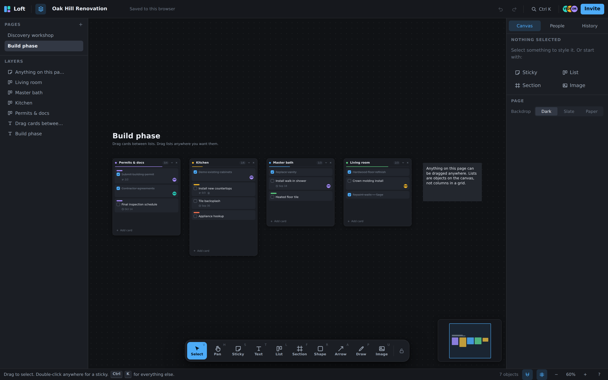
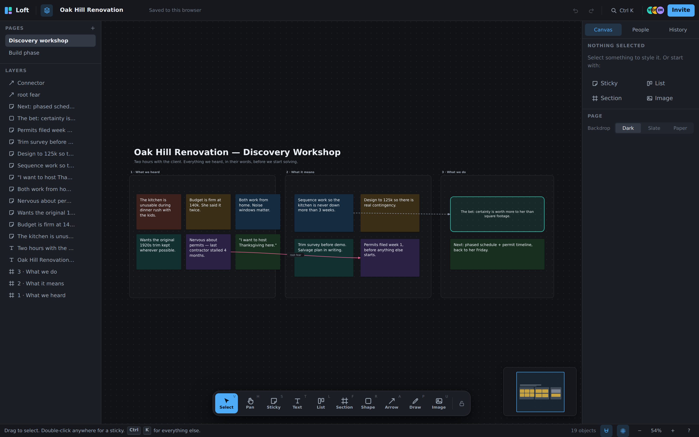

# Loft

A freeform project canvas with real boards on it — the Figma half and the Trello half in one
document, so nothing has to be kept in sync between two tools.

**[DESIGN.md](./DESIGN.md) is the design of the platform**: the problem, the principles, the object
model, and what comes next. **[DEPLOY.md](./DEPLOY.md) is how to put it live** with real accounts.
This file covers running the code.





---

## Run it

```bash
npm install
npm run dev          # http://localhost:5173
```

Other scripts:

```bash
npm run typecheck        # strict TypeScript, no emit
npm run build            # production build into dist/
npm run package          # build, then zip a deployable site + backend into loft-deploy.zip
npm run bundle           # a sandbox build flattened into one self-contained HTML file
./scripts/test-schema.sh # run the database access rules against a throwaway Postgres
```

It opens on a sample project — a home renovation with a discovery workshop on one page and the
delivery board on another — because the fastest way to understand a canvas tool is to open one that
already has someone's thinking on it. **Reset to the sample project** in the command palette gets it
back at any time.

## Try these first

| | |
|---|---|
| Double-click anywhere | New sticky, caret already in it |
| Drag a card between lists | Works across lists, and past the edge of one |
| Drag a list by its header | Lists are canvas objects, not grid columns |
| Select some notes → right-click → **Turn into a list of cards** | The hinge between the two halves |
| `⌘K` / `Ctrl K` | Every command in the product, searchable |
| Drop a screenshot on the window | Lands where you dropped it |
| `?` | Shortcuts |

## Two ways to run

`config.js` decides, at load time, which one you get — so the same build works for both and moving
between them needs no rebuild.

**Sandbox** (`mode: 'demo'`) — no accounts, no server. The document lives in `localStorage` and
uploaded images in IndexedDB, all local to one browser. Good for trying the thing out; never for
real work.

**Connected** (`mode: 'supabase'`) — real accounts, invitations by email, and projects stored in
Postgres. Nothing renders until you sign in, and the database itself refuses to hand a project to
anyone who isn't on its member list. `DEPLOY.md` walks through it.

A build that finds neither shows a setup screen rather than starting. That is deliberate: an
unconfigured deployment should look broken, not unlocked.

### The security model, in one line

The app shell is public — every web app's is. The **data** is what's protected, by row-level
security in Postgres. `./scripts/test-schema.sh` proves it: sixteen assertions covering what a
stranger, a viewer, an editor and a removed member can each actually reach.

## Layout

```
src/
├── types.ts              the whole document model, in one file
├── store/
│   ├── store.ts          state, actions, undo history with coalescing
│   ├── useStore.ts       selector-based React binding
│   ├── persistence.ts    autosave, export, import
│   ├── assets.ts         IndexedDB image store
│   └── sampleDoc.ts      the starter project
├── canvas/
│   ├── Canvas.tsx        viewport, every pointer gesture, tool dispatch
│   ├── SelectionLayer    selection box, resize handles, hover outlines
│   ├── ConnectorLayer    attached arrows, painted above everything
│   ├── snapping.ts       edge/centre alignment with visible guides
│   └── viewportRef.ts    live canvas geometry, shared with menus and commands
├── nodes/                one component per node type; BoardView is the Trello half
├── ui/                   chrome: toolbar, panels, palette, dialogs, minimap
├── hooks/                hotkeys, clipboard, file drop, autosave, remote save
├── auth/                 backend interface + Supabase and sandbox implementations
├── ui/auth/              sign in, invitations, password reset, project list
└── lib/                  geometry, factories, palette, command registry

supabase/
├── schema.sql            tables, row-level security, image bucket
├── functions/invite/     the one step that needs a server: sending an invitation
└── tests/                assertions that the access rules do what they claim
```

Two conventions worth knowing before editing:

- **Gestures bind to the window, never to the element.** A drag must survive the pointer leaving
  whatever started it.
- **One gesture is one undo.** Live updates during a drag commit without history; `beginTransform`
  snapshots the document once at the start of the gesture.

## Stack

React 19, TypeScript (strict), Vite, Immer, and the Supabase client when a backend is configured.
No canvas library, no drag library, no UI kit — the interaction model is the product, so it is
written out rather than configured.

The backend sits behind one interface (`src/auth/types.ts`) with two implementations, so swapping
Supabase for something else is one file, not a rewrite.

## Templates

`templates/` holds standalone web design templates that ship separately from the app — static,
dependency-free, and meant to be copied out. See [templates/README.md](./templates/README.md).
